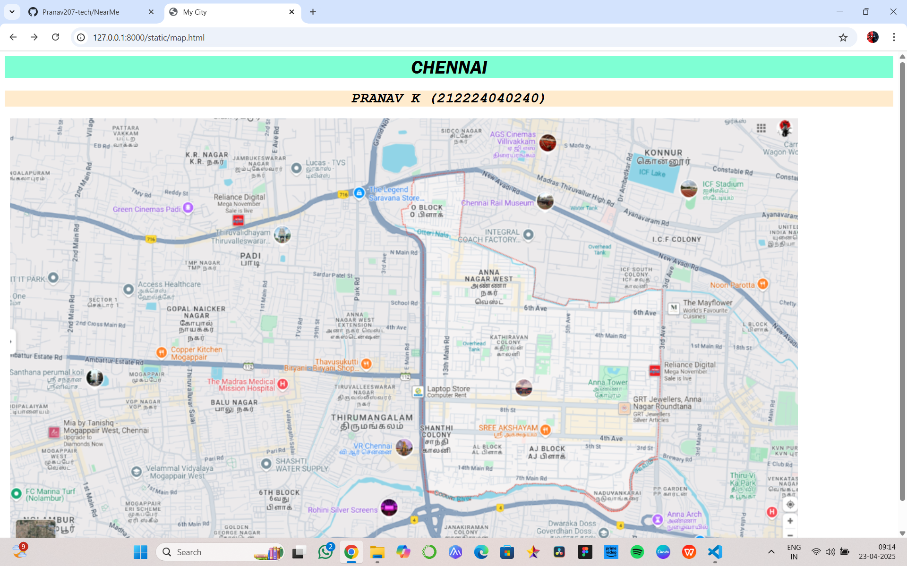

# Ex04 Places Around Me
## Date: 23.04.25
## Name: Pranav K
## Reg no: 212224040240

## AIM
To develop a website to display details about the places around my house.

## DESIGN STEPS

### STEP 1
Create a Django admin interface.

### STEP 2
Download your city map from Google.

### STEP 3
Using ```<map>``` tag name the map.

### STEP 4
Create clickable regions in the image using ```<area>``` tag.

### STEP 5
Write HTML programs for all the regions identified.

### STEP 6
Execute the programs and publish them.

## CODE

```
map.html

<html>
    <head>
        <title>
            My City
        </title>
    </head>

    <body>
        <h1 align="center" style="background-color: aquamarine;font-style: italic;font-family: 'Franklin Gothic Medium', 'Arial Narrow', Arial, sans-serif;">
            CHENNAI
        </h1>
        <h2 align="center" style="background-color: blanchedalmond;font-style: oblique;font-family: 'Courier New', Courier, monospace;">
            PRANAV K (212224040240)
        </h2>\
        
        <map name="MyCity">
            <area target="" alt="VR MALL" title="VR MALL" href="mall.html" coords="542,526,702,585" shape="rect">
            <area target="" alt="ROHINI THEATRE" title="ROHINI THEATRE" href="theater.html" coords="479,625,682,689" shape="rect">
            <area target="" alt="SARAVANA STORES" title="SARAVANA STORES" href="store.html" coords="634,120,64" shape="circle">
            <area target="" alt="CHENNAI RAIL MUSEUM" title="CHENNAI RAIL MUSEUM" href="museum.html" coords="896,136,60" shape="circle">
            <area target="" alt="MMM HOSPITAL" title="MMM HOSPITAL" href="hospital.html" coords="316,473,495,400" shape="rect">
        </map>
    </body>
</html>
```
```
hospital.html

<html>
<head>
    <title>Madras Medical Mission Hospital</title>
</head>
<body style="font-family: 'Trebuchet MS', 'Lucida Sans Unicode', 'Lucida Grande', 'Lucida Sans', Arial, sans-serif; background-color: aquamarine; color:goldenrod; padding: 20px;">

    <h1 style="color: green; text-align: center;">Madras Medical Mission Hospital</h1>

    <p style="font-size: 1.2em; text-align: justify; line-height: 1.6;">
        The Madras Medical Mission (MMM) Hospital, located in Mogappair, Chennai, is one of India's premier healthcare institutions, renowned for its excellence in medical care and research. 
        Established in 1987 as a non-profit charitable organization, the hospital has grown into a multi-specialty facility providing world-class healthcare services to patients from across the globe.
        The hospital was founded with a mission to combine compassion, quality care, and advanced medical technology. 
        Over the years, it has become synonymous with excellence in medical treatment, particularly in the fields of cardiology, nephrology, and critical care.
</body>
</html>
```
```
museum.html

<html>
<head>
    <title>Chennai Rail Museum</title>
</head>
<body style="font-family: Impact, Haettenschweiler, 'Arial Narrow Bold', sans-serif; background-color: mediumblue; color: burlywood; padding: 20px; font-style: italic;">

    <h1 style="color: azure; text-align: center;">Chennai Rail Museum</h1>

    <p style="font-size: 1.2em; text-align: justify; line-height: 1.6;">
        The Chennai Rail Museum, located in the heritage area of Perambur, is one of the most popular and informative museums in Chennai. 
        Established in 2002 by the Southern Railway, it offers a fascinating journey through the history of Indian Railways, showcasing the evolution of the railway system in the country.
        The museum is housed on an expansive campus, with displays of rare and historical locomotives, coaches, and other railway artifacts. 
        Visitors can witness how the Indian Railways system has transformed over the years, from its colonial beginnings to the modern-day advancements in technology and design.
    </p>
</body>
</html>
```
```
store.html

<html>
<head>
    <title>Saravana Stores</title>
</head>
<body style="font-family: 'Helvetica', sans-serif; background-color: teal; color: indigo; padding: 20px;">

    <h1 style="color: blanchedalmond; text-align: center;">Saravana Stores</h1>

    <p style="font-size: 1.2em; text-align: justify; line-height: 1.6;">
        Saravana Stores is one of Chennai's most iconic and popular retail chains, known for its extensive range of products and exceptional value. 
        Established in the 1960s, the store has grown from a small shop to a massive multi-store complex, offering everything from clothing and accessories to home goods and electronics.
        Over the years, Saravana Stores has built a loyal customer base, with many returning for the competitive pricing and wide range of products. 
        The store's constant reinvestment into expanding its offerings and updating its collections has made it a shopping landmark in Chennai.
    </p>
</body>
</html>
```
```
theater.html

<html>
<head>
    <title>Rohini Theatre - Chennai</title>
</head>
<body style="font-family: 'Franklin Gothic Medium', 'Arial Narrow', Arial, sans-serif; background-color: lightgray; text-align: center; color: black;">

    <h1 style="color: darkred;">Rohini Theatre - Chennai</h1>

    <p>
        Rohini Theatre, located in Koyambedu, Chennai, is one of the city's most iconic cinema halls, known for its rich history and modern facilities. 
        Established in 1980, the theatre has been a part of Chennai's cultural fabric for over four decades, evolving from a single-screen cinema to a state-of-the-art multiplex.
    </p>
    <p>
        Rohini Theatre is particularly known for its grand premieres and first-day-first-show celebrations. 
        Fans of Tamil cinema flock to the theatre to celebrate the release of major blockbusters, often accompanied by festive decorations, live music, and the energy of an enthusiastic crowd.
    </p>
</body>
</html>
```
```
mall.html

<html>
<head>
    <title>VR Mall Anna Nagar</title>
</head>
<body style="font-family: Arial, sans-serif; background-color: lightcoral; text-align: center; color:white;">

    <h1 style="color: darkblue;">VR Mall Anna Nagar</h1>

    <p>
        VR Mall, located in the vibrant neighborhood of Anna Nagar, Chennai, is more than just a shopping destination. 
        Opened in 2018, this state-of-the-art lifestyle hub quickly became a landmark, redefining the shopping and entertainment experience for residents and visitors alike.
    </p>
    <p>
        One of the standout features of VR Mall is its multiplex cinema. 
        Equipped with cutting-edge technology and luxurious seating, it offers an unparalleled movie-watching experience. 
        Whether you're catching the latest blockbuster or enjoying a classic film, the VR Mall cinema guarantees entertainment at its best.
    </p>
</body>
</html>
```

## OUTPUT


.png>)

.png>)

.png>)

.png>)

.png>)


## RESULT
The program for implementing image maps using HTML is executed successfully.
